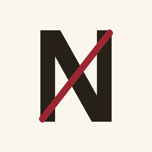

<div align="center">
  

  <h1>Norns POS</h1>

  <p>Die Kasse für Juweliere und Edelmetallhändler in Deutschland.<br />
  TSE, DSFinV-K 2.4, DATEV und Kassenbericht, exakt und prüfbar.</p>
</div>

## Was Norns POS ist

Norns POS ist ein schlankes Kassenprogramm für Betriebe, die mit wertvollen
Gütern handeln: Schmuck, Edelmetalle, Nachlässe. Es läuft am Tresen, führt
den Händler bei der ersten Inbetriebnahme Schritt für Schritt durch alles,
was das Steuerrecht verlangt, und bleibt danach aus dem Weg.

Der Schwerpunkt liegt auf steuerlicher Korrektheit. Jeder Beleg wird von
einer zertifizierten technischen Sicherheitseinrichtung signiert
(§ 146a AO). Die Ausfuhren für den Prüfer (DSFinV-K 2.4), für den
Steuerberater (DATEV) und der tägliche Kassenbericht kommen aus derselben
Quelle wie die Belege selbst, ohne zweite Buchführung daneben.

## Die Grundsätze

1. **Nur die Kasse.** Kein Webshop, kein Kanalvertrieb, keine Cloud-Pflicht.
   Die Kasse gehört dem Händler und läuft auf seinem Gerät.
2. **Steuer zuerst.** Differenzbesteuerung nach § 25a UStG, Ankaufbeleg,
   Identitätspflichten nach dem Geldwäschegesetz, Belegausgabepflicht,
   Kassenmeldung nach § 146a Abs. 4 AO. Was das Gesetz verlangt, führt die
   Kasse, und was sie führt, kann der Prüfer sehen.
3. **Ehrliche Flächen.** Eine Zahl auf dem Bildschirm ist eine gemessene
   Zahl. Ein Fehler wird mit seinem Grund gezeigt, nicht mit einem
   Sammelsatz. Was nicht eingerichtet ist, sagt das offen.
4. **Branchen als Module.** Metallkurse und Waage lassen sich je Betrieb
   ein- und ausschalten. Ein Betrieb ohne Edelmetall sieht beides nie.

## Der Aufbau

| Pfad | Inhalt |
|---|---|
| `apps/tauri-pos` | Die Kasse: Tauri 2, React, eingebettetes Postgres 17 |
| `apps/api-cloud` | Der Motor: Fastify und Drizzle, läuft als gebündelter Beipack in der Kasse |
| `packages/db` | Schema und Wanderungen |
| `packages/domain` | Geschäftslogik: Geld, Steuer, Preise |
| `packages/api-client` | Der typisierte Klient über dem Motor |
| `packages/ui-kit` | Gestaltungsmarken und Bauteile der Kasse |
| `packages/i18n-de` | Das deutsche Vokabular, vollständig und ohne rohe Kennungen |

## Entwicklung

```bash
pnpm install
pnpm typecheck
pnpm test
```

Die Verbundtests fahren gegen ein echtes Postgres aus
`infrastructure/docker/docker-compose.yml`. Ein Test, der nur Quelltext
liest, gilt in diesem Haus nicht als Beweis.

Das vollständige Wissen für jede Arbeit an diesem Baum steht in
[`docs/ENTWICKLUNG.md`](docs/ENTWICKLUNG.md), die Gestaltungsregeln in
[`docs/DESIGN-SYSTEM.md`](docs/DESIGN-SYSTEM.md).

## Rechtliches

Norns POS wird in Deutschland entwickelt. Fragen zu Betrieb und Einsatz:
[norns.de](https://norns.de)
